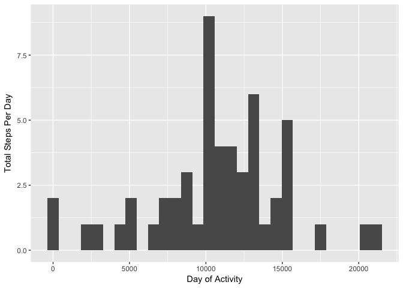
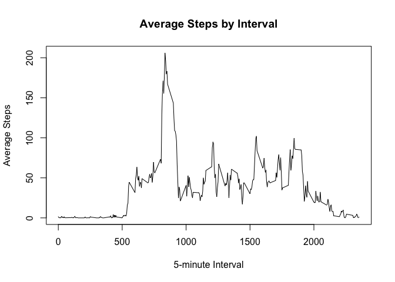

# Reproducible Research Project 1
Matthew Hirning  
7/16/2017  


## Loading and preprocessing the data

Here we load the data set and clean it for our processing. In this case, our data is fairly simple and we are going to do some processing later on in this file.


```r
activity <- read.csv("./activity.csv")
```

## What is mean total number of steps taken per day?

Once we have clean data, we can extract data like the total number of steps for each day:


```r
by_day <- tapply(activity$steps, activity$date, sum)
str(by_day)
```

```
##  int [1:61(1d)] NA 126 11352 12116 13294 15420 11015 NA 12811 9900 ...
##  - attr(*, "dimnames")=List of 1
##   ..$ : chr [1:61] "2012-10-01" "2012-10-02" "2012-10-03" "2012-10-04" ...
```

Once we have that data, we can make a histogram of it:


```r
library(ggplot2)
qplot(by_day, xlab = "Day of Activity", ylab = "Total Steps Per Day", Main = "Total Steps for Each Day")
```

```
## Warning: Ignoring unknown parameters: Main
```

```
## `stat_bin()` using `bins = 30`. Pick better value with `binwidth`.
```

```
## Warning: Removed 8 rows containing non-finite values (stat_bin).
```

<!-- -->

We can extract summary statistics such as mean and median steps:


```r
mean(by_day, na.rm = TRUE)
```

```
## [1] 10766.19
```

```r
median(by_day, na.rm = TRUE)
```

```
## [1] 10765
```

## What is the average daily activity pattern:

We can create average the steps taken in each 5-minute interval across all the days and create a time plot of them:


```r
avg_int_steps <- tapply(activity$steps, activity$interval, mean, na.rm = TRUE)
plot(unique(activity$interval), avg_int_steps, type = "l", xlab = "5-minute Interval", ylab = "Average Steps", main = "Average Steps by Interval")
```

<!-- -->

Then we can see visually as well as analytically which interval has the highest average step count:


```r
activity$interval[match(max(avg_int_steps), avg_int_steps)]
```

```
## [1] 835
```

## Imputing Missing Values

First, we need to see how much of our data is missing:


```r
sum(is.na(activity$steps))
```

```
## [1] 2304
```

```r
sum(is.na(activity$interval))
```

```
## [1] 0
```

```r
sum(is.na(activity$date))
```

```
## [1] 0
```

From this, we can see that only data for steps is missing.

Next, we need to fill in that data using some strategy. I chose to impute the missing data based on the mean of the interval because using this strategy, the mean across intervals does not change, which I believe to be the more interesting comparison.

We can use this strategy to create a second data set with the missing values filled in.


```r
  new_data <- activity
  for(i in 1:length(new_data$steps)){
    if(is.na(new_data$steps[i])){
      index <- match(new_data$interval[i], dimnames(avg_int_steps)[[1]])
      new_data$steps[i] <- avg_int_steps[index]
    }
  }
```

Check to make sure our code works:


```r
sum(is.na(new_data$steps))
```

```
## [1] 0
```

```r
new_avg_int_steps <- tapply(new_data$steps, new_data$interval, mean)
identical(new_avg_int_steps, avg_int_steps)
```

```
## [1] TRUE
```

From these two tests, we can see that we have correctly imputted the data by the interval average.

We can then perform analysis on our modified data set to see how this has changed our original data set:


```r
new_by_day <- tapply(new_data$steps, new_data$date, sum)
qplot(new_by_day, xlab = "Day of Activity", ylab = "Total Steps Per Day (w/ imputted data)", Main = "Total Steps for Each Day (w/ imputted data)")
```

```
## Warning: Ignoring unknown parameters: Main
```

```
## `stat_bin()` using `bins = 30`. Pick better value with `binwidth`.
```

<!-- -->


```r
mean(new_by_day)
```

```
## [1] 10766.19
```

```r
median(new_by_day)
```

```
## [1] 10766.19
```

As we can see, by inputing the data, the data has changed slightly. Because we imputted the missing data by the mean, the mean of the date set has not changed, but the median has shifted slightly to be aligned with the mean. This makes sense considering we added approximately 2000 values equal to the mean.  

## Are there difference in activity patterns between weekdays and weekends?

Before doing this analysis, we have to create a factor variable to mark each day as either a weekday or a weekend.


```r
  wknd <- vector(length = length(new_data$date))
  for(i in 1:length(new_data$date)){
    if(weekdays(as.Date(new_data$date[i], '%Y-%m-%d')) %in% c("Saturday", "Sunday")){
      wknd[i] <- 1
    }
    else{
      wknd[i] <- 0
    }
  }
  wknd <- as.factor(wknd)
  levels(wknd) <- c("Weekday", "Weekend")
  new_data <- data.frame(steps = new_data$steps, date = new_data$date, interval = new_data$interval, wknd = wknd)
```

Now we can use the factor variable to do analysis. We can create a time series plot similar to the first plot we made but comparing the weekdays and weekends:


```r
  wknd_data <- aggregate(steps ~ interval + wknd, data = new_data, FUN = "mean")
  par(mfrow = c(2,1), mar = c(4,4,2,1))
  plot(wknd_data[wknd_data$wknd == "Weekday", "interval"], wknd_data[wknd_data$wknd == "Weekday", "steps"], 
       type = "l", xlab = "Interval", ylab = "Steps", main = "Weekday Activity vs. Weekend Activity",
       col = "red")
  legend(x = 1250, y = 225, legend = c("Weekday", "Weekend"), col = c("red", "blue"), lwd = 2)
  plot(wknd_data[wknd_data$wknd == "Weekend", "interval"], wknd_data[wknd_data$wknd == "Weekend", "steps"], 
       type = "l", xlab = "Interval", ylab = "Steps", col = "blue")
```

<!-- -->


As we can see, people are slightly less active during the weekends. The are also more active during the middle of the day. This is to be expected considering most people are active before and after work hours during the week and are not as active at their jobs.
